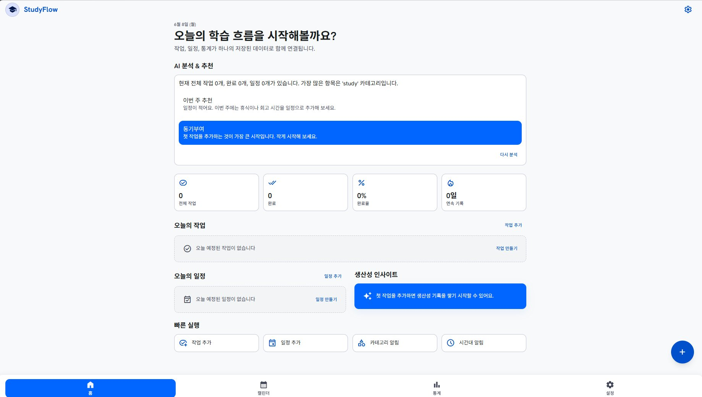

# StudyFlow

> **사용자의 마감일·중요도·미룬 횟수를 AI가 분석해, 오늘의 작업 우선순위와 동기부여를 실시간으로 바꿔주는 적응형(Adaptive) 학습 To-Do List**

StudyFlow는 단순히 할 일을 나열하는 체크리스트가 아니라, **지금 사용자가 처한 상황**(마감 임박, 일정 지연, 시험 일정, 완료율 등)에 따라 화면과 추천이 능동적으로 변하는 적응형 학습 관리 앱입니다.

---

## 우리 팀의 Adaptiveness (적응형 컨셉)

> **"기존 체크리스트와 달리, 같은 할 일 목록이라도 사용자의 상황과 행동 패턴에 따라 다르게 보여준다."**

StudyFlow의 인터페이스는 고정되어 있지 않고, 아래 네 가지 축에 따라 실시간으로 변합니다.

| 적응 축 | 변화 요인 | 인터페이스가 변하는 방식 |
| --- | --- | --- |
| **상황 변화** | 시간대 · 마감 D-Day · 완료율 | 시험 기간엔 공부 일정이 상단에, 마감 임박 항목은 색상 강조 |
| **우선순위** | 마감일 · 중요도 · 미룬 횟수 | 긴급도 기반으로 "오늘의 TOP 3"를 자동 추천·정렬 |
| **사용자 행동 반영** | 완료 패턴 · 미룬 횟수 | 반복해서 미룬 항목은 경고를 강화하거나 더 작은 목표로 추천 |
| **동기부여** | 오늘 완료율 | 완료율에 따라 칭찬/격려 메시지를 AI가 생성 |

즉, **사용자의 학습 상황을 분석 → UI가 우선순위·추천·동기부여를 적응적으로 재구성**하는 것이 StudyFlow의 핵심 컨셉입니다. (기존 고정형 To-Do와의 **Before/After** 차이가 핵심 차별점입니다.)

---

## 주요 기능

- **홈 대시보드** — 가장 시급한 할 일, 오늘의 할 일, 미뤄진 할 일, AI 스마트 제언을 상황에 맞게 표시
- **항목 추가** — 제목·마감일·중요도·카테고리 입력, 입력값에 따른 예상 우선순위 미리보기
- **목록 관리** — 추가/수정/삭제/완료 + 마감일·미룸 횟수 기반 자동 정렬
- **인터랙티브 캘린더** — 일정 기반 학습 계획 시각화
- **학습 통계** — 완료율·카테고리별 통계, 취약 카테고리 표시 (AI 기능 활성화 시 AI 분석 결과 표시)
- **AI 분석 기능** — 할 일/일정을 분석해 요약·추천·동기부여 메시지 제공 (옵트인)
- **맥락 알림** — 시간대 알림, 카테고리 알림, 방해금지 시간 설정

---

## 기술 스택

- **Frontend**: React 18, Vite, React Router, Tailwind CSS
- **Backend (AI Server)**: Node.js, Express
- **AI**: OpenAI API 연동 (미설정 시 로컬 fallback 메시지로 동작)

---

## 팀원 역할

| 이름 | 역할 |
| --- | --- |
| **이욱현** | 프로젝트 총괄 및 적응형(Adaptive) 로직 설계 |
| **김강현** | 데이터 관리 및 시스템 구조 / 발표 |
| **강한웅** | 서비스 구조 설계 및 UI/UX 기획 |
| **최현준** | 협업 환경 및 기술 통합 (Git) |

---

## 실행 화면

홈 대시보드 — 오늘의 학습 흐름, AI 분석·추천, 진행 현황을 한 화면에서 확인할 수 있습니다.



---

## 프로젝트 구조

```
oss_todo_list/
├─ src/            # React + Vite 프런트엔드 (메인 To-Do / 스케줄 앱)
├─ server/         # Express 기반 AI 서버 (분석·동기부여 메시지 제공)
├─ index.html
├─ package.json
├─ vite.config.js
├─ tailwind.config.js
└─ README.md
```

> Stitch로 내보낸 디자인 목업 HTML과 실제 React 소스는 의도적으로 분리해 관리합니다.

---

## 실행 방법

### 1) 프런트엔드 (To-Do 앱)

```bash
cd oss_todo_list
npm install        # 최초 1회
npm run dev
# 브라우저에서 http://localhost:5173 접속
```

### 2) AI 서버

```bash
cd oss_todo_list/server
npm install        # 최초 1회

# (선택) 실제 OpenAI API 사용 시 환경변수 설정
# Windows PowerShell:
$env:OPENAI_API_KEY="your_openai_api_key"
# macOS/Linux:
export OPENAI_API_KEY="your_openai_api_key"

npm start
# 상태 확인: http://localhost:5174
```

- `GET  /ai/motivation` : AI 동기부여 메시지 반환
- `POST /ai/insights`   : 할 일/일정 목록을 보내면 요약·추천·동기부여 반환

> **설정**에서 AI 기능을 켜야 **통계** 화면에 AI 분석 결과가 표시됩니다.